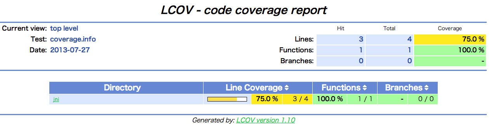
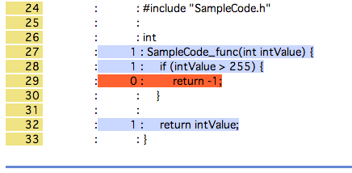

!!!! NOTICE !!!!
===========================
This project was deprecated. Please don't use this project

Now you can find google test in the official Android NDK. Please follow the official instructions of Android NDK.


googletest with Android NDK and gcov
============================

This project shows below topics

1. How to build googletest with Android NDK
2. How to get code coverage with gcov on Android.

googletest is Google's unit test framework for C++.

googletest: https://code.google.com/p/googletest/

How to build
------------

1. Download source code of googletest

  ```
  $ mkdir googletest
  $ cd googletest
  $ svn checkout http://googletest.googlecode.com/svn/trunk/ .
  ```

2. Copy jni directory to googletest directory
  ```
  $ cd /path/to/this/git
  $ cp -r jni googletest/
  ```
3. run ndk-build script
  ```
  $ cd googletest/
  $ ndk-build
  ```
4. You can find libgtest.a in googletest/obj/local/armeabi/libgtest.a

How to use libgtest.a
---------------------

See sample/test_project

```
$ cd sample/test_project

$ ndk-build
Compile++ thumb  : sample_code_test <= SampleCodeTestMain.cpp
Compile++ thumb  : sample_code_test <= SampleCode.cpp
Compile++ thumb  : sample_code_test <= SampleCodeTestCase.cpp
Executable     : sample_code_test
Install        : sample_code_test => libs/armeabi/sample_code_test
....

$ adb push  obj/local/armeabi/sample_code_test /data/local/tmp/

$ adb shell /data/local/tmp/sample_code_test
[==========] Running 1 test from 1 test case.
[----------] Global test environment set-up.
[----------] 1 test from SampleCode
[ RUN      ] SampleCode.func
[       OK ] SampleCode.func (1 ms)
[----------] 1 test from SampleCode (1 ms total)

[----------] Global test environment tear-down
[==========] 1 test from 1 test case ran. (7 ms total)
[  PASSED  ] 1 test.
```

Code Coverage with gcov
-----------------------

See sample/test_project

```
$ cd sample/test_project

$ ndk-build
.....
Compile++ thumb  : sample_code_test_code_coverage <= SampleCodeTestMain.cpp
Compile++ thumb  : sample_code_test_code_coverage <= SampleCode.cpp
Compile++ thumb  : sample_code_test_code_coverage <= SampleCodeTestCase.cpp
Executable     : sample_code_test_code_coverage
Install        : sample_code_test_code_coverage => libs/armeabi/sample_code_test_code_coverage

$ adb push obj/local/armeabi/sample_code_test_code_coverage /data/local/tmp/

$ adb shell GCOV_PREFIX=/data/local/tmp /data/local/tmp/sample_code_test_code_coverage
[==========] Running 1 test from 1 test case.
[----------] Global test environment set-up.
[----------] 1 test from SampleCode
[ RUN      ] SampleCode.func
[       OK ] SampleCode.func (1 ms)
[----------] 1 test from SampleCode (3 ms total)

[----------] Global test environment tear-down
[==========] 1 test from 1 test case ran. (8 ms total)
[  PASSED  ] 1 test.

$ pwd
/path/to/googletest_android_ndk-build/sample/test_project

$ adb pull /data/local/tmp/path/to/googletest_android_ndk-build/sample/test_project/obj/local/armeabi/objs-debug/sample_code_test_code_coverage/SampleCode.gcda obj/local/armeabi/objs-debug/sample_code_test_code_coverage/

$ lcov --gcov-tool /path/to/ndk/android-ndk-r8e/toolchains/x86-4.6/prebuilt/darwin-x86_64/bin/i686-linux-android-gcov --capture --directory obj/local/armeabi/objs-debug/sample_code_test_code_coverage --output-file coverage.info
Capturing coverage data from obj/local/armeabi/objs-debug/sample_code_test_code_coverage
Found gcov version: 4.6
Scanning obj/local/armeabi/objs-debug/sample_code_test_code_coverage for .gcda files ...
Found 1 data files in obj/local/armeabi/objs-debug/sample_code_test_code_coverage
Processing SampleCode.gcda
Auto-detected compatibility mode for split checksum .gcno file format
Finished .info-file creation

$ genhtml coverage.info --branch-coverage --output-dir coverage
Reading data file coverage.info
Found 1 entries.
Found common filename prefix "/path/to/googletest_android_ndk-build/sample/test_project"
Writing .css and .png files.
Generating output.
Processing file jni/SampleCode.cpp
Writing directory view page.
Overall coverage rate:
  lines......: 75.0% (3 of 4 lines)
  functions..: 100.0% (1 of 1 function)
  branches...: no data found

$ google-chrome coverage/index.html
```
You can see a caverage report as below.



Click file name and you can find line coverage as below.



### Build Details

See sample/test_project/jni/Android.mk

Add --coverage to compiler and linker flags (LOCAL_CFLAGS and LOCAL_LDFALGS)

```Makefile
include $(CLEAR_VARS)
GTEST_DIR := external/gtest
LOCAL_MODULE := sample_code_test_code_coverage
LOCAL_STATIC_LIBRARIES := gtest-prebuilt
LOCAL_CFLAGS := --coverage
LOCAL_LDFLAGS := --coverage
LOCAL_SRC_FILES := \
    SampleCodeTestMain.cpp \
    SampleCode.cpp \
    SampleCodeTestCase.cpp
include $(BUILD_EXECUTABLE)
```

And next see sample/test_project/jni/Application.mk

Set 'debug' as APP_OPTIM to avoid optimization.

```Makefile
APP_STL := gnustl_static
APP_OPTIM := debug
```

### References
* Gcov : http://gcc.gnu.org/onlinedocs/gcc-4.6.4/gcc/Gcov.html#Gcov
* --coverage : http://gcc.gnu.org/onlinedocs/gcc-4.6.4/gcc/Debugging-Options.html#index-coverage-537
* GCOV_PREFIX : http://gcc.gnu.org/onlinedocs/gcc-4.6.4/gcc/Cross_002dprofiling.html#Cross_002dprofiling
* lcov : http://ltp.sourceforge.net/coverage/lcov.php
